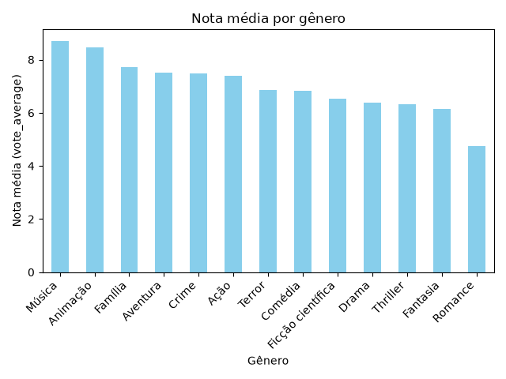
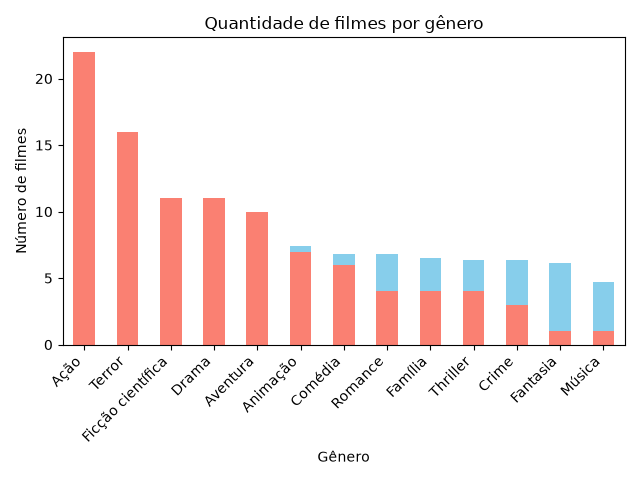
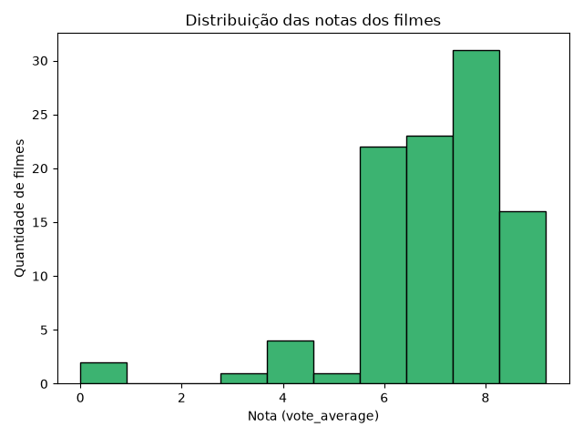
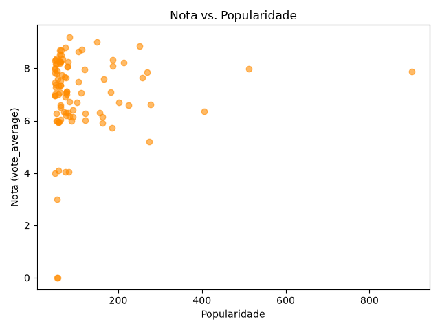

# TMDB Analytics 🎬

Projeto de análise de dados que consome a API pública do TMDB (The Movie 
Database) para coletar, tratar e analisar informações sobre filmes 
populares, com persistência em banco de dados SQLite.

## O que o projeto faz

- Consome uma API REST externa (TMDB) para coletar dados de filmes
- Trata e organiza os dados com Pandas (tipos de data, mapeamento de 
  gêneros, remoção de dados incompatíveis com SQL)
- Persiste os dados em um banco SQLite local
- Realiza análises estatísticas: nota média por gênero, correlação entre 
  popularidade e avaliação, ranking dos filmes mais bem avaliados

## Tecnologias

- Python 3
- Pandas
- Requests
- SQLite3
- python-dotenv

## Como rodar o projeto

1. Clone o repositório

## Análise de Dados

Após coletar 100 filmes populares da API do TMDB, realizei uma análise exploratória com Pandas e Matplotlib.

### Nota média por gênero

O gênero **Música** apresentou a maior nota média (8.7), seguido por **Animação** (8.47). Já **Romance** teve a menor média (4.73).

### Quantidade de filmes por gênero

**Ação** é o gênero mais frequente entre os filmes populares (22 filmes), seguido por **Terror** (16). Isso mostra que gêneros com poucos filmes (como Música, com apenas 1) podem ter médias de nota pouco representativas.

### Distribuição das notas

A maioria dos filmes está concentrada na faixa de nota entre 6 e 8, indicando uma distribuição próxima da normal, com poucos filmes nos extremos.

### Nota vs. Popularidade

A correlação entre popularidade e nota foi de **0.08**, próxima de zero — ou seja, não há relação relevante entre o quão popular um filme é e a nota que ele recebe.